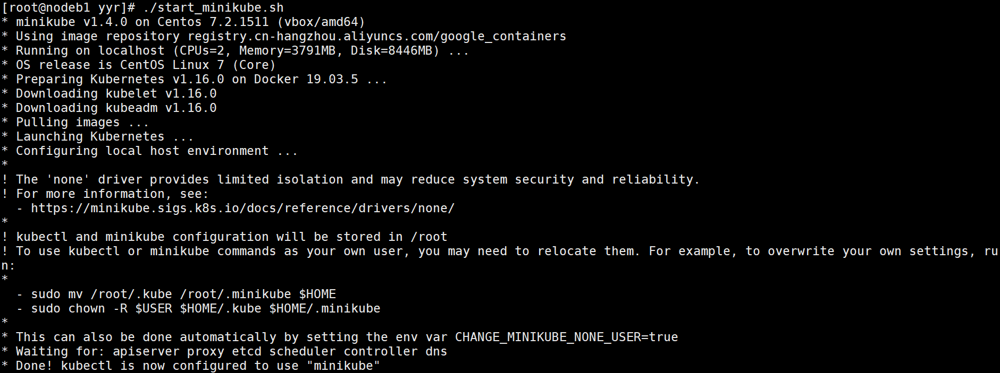
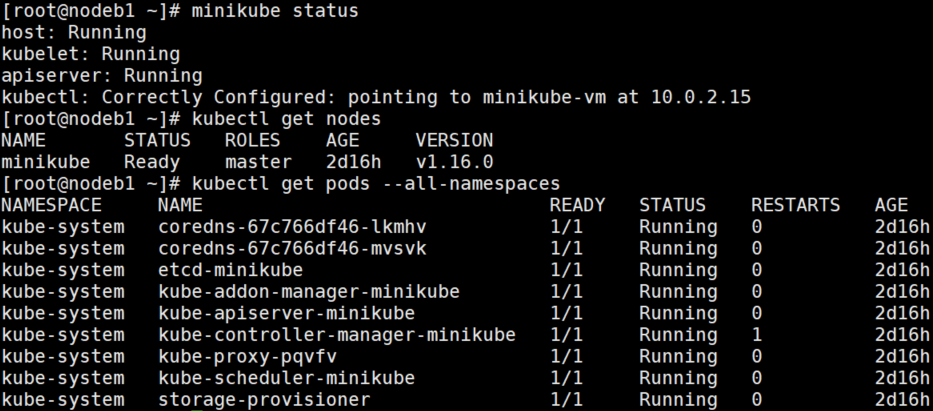

## 使用 Minikube 在 Kubernetes 中运行应用

### 目标
将简单的 Hello World Node.js 应用转换为在 Kubernetes 上运行的应用
* 如何使用自己开发的代码，将其转换为 Docker 容器镜像
* 然后在 Minikube 上运行该镜像，Minikube能够在本地非常简单的创建 Kubernetes
### 准备工作
* 一台 centos7 虚拟机
* 本实验是在虚拟机中运行的 Linux 做测试，由于虚拟机管理程序不允许嵌套虚拟化，所以，无需再安装驱动程序，使用None(裸机)驱动程序即可。
### 创建 Minikube 集群
1. start_minikube.sh
执行该脚本，在 centOS7 中构建一个单节点的 k8s 环境
* 验证 minikube 运行环境
* 在 docker 上预加载 Kubernates，验证 docker
* 下载 kubelet、kubeadm(当前实验版本为v1.16)
* 拉取 Kubernates 镜像
* 启动 Kubernates
看到以下结果，说明启动成功！



查询集群相关信息



2. restart_minikube.sh
一般第一次会启动失败，重启就可以了
* 删除现有的 minikube 及相关配置文件
* 重新启动 minikube
### 创建 Node.js 应用程序
1. server.js
2. 运行应用，需要先在 linux 上安装 node 环境 node_install.sh
``` bash
node server.js
```
3. 现在可以在 http://192.168.100.61:8080/ 中查看到“Hello World！”消息。
4. 按 Ctrl-C 停止正在运行的 Node.js 服务器。下一步将应用程序打包到 Docker 容器中。
### 创建 Docker 容器镜像
1. Dockerfile
2. 构建镜像
``` bash
docker build -t hello-node:v1 .
```
### 创建 Deployment
1. 创建 Deployment 来管理 Pod。Pod 根据 hello-node:v1Docker 运行容器镜像：
``` bash
kubectl run hello-node --image=hello-node:v1 --port=8080
```
2. 查看 Deployment：
``` bash
[root@nodeb1 hellonode]# kubectl get deployments
NAME         READY   UP-TO-DATE   AVAILABLE   AGE
hello-node   1/1     1            1           119s
```
3. 查看 Pod：
``` bash
[root@nodeb1 hellonode]# kubectl get pods
NAME                          READY   STATUS    RESTARTS   AGE
hello-node-587b55f6f4-jfwzj   1/1     Running   0          2m25s
```
4. 查看群集 events：
``` bash
kubectl get events
```
5. 查看 kubectl 配置：
``` bash
kubectl config view
```
### 创建Service
默认情况，这 Pod 只能通过 K8s 群集内部 IP 访问。要使 hello-node 容器从 K8s 虚拟网络外部访问，须要暴露 Pod。
1. 将 Pod 暴露到外部环境：
``` bash
kubectl expose deployment hello-node --type=LoadBalancer
```
2. 查看刚创建的 Service：
``` bash
[root@nodeb1 hellonode]# kubectl get services
NAME         TYPE           CLUSTER-IP      EXTERNAL-IP   PORT(S)          AGE
hello-node   LoadBalancer   10.111.85.221   <pending>     8080:32083/TCP   10s
kubernetes   ClusterIP      10.96.0.1       <none>        443/TCP          4d21h
```
3. 在 Minikube 上，该 LoadBalancer type 使服务可以通过 minikube Service 命令访问。
``` bash
minikube service hello-node
```
4. 将打开浏览器，在本地IP地址为应用提供服务，显示“Hello World”的消息。
5. 最后可以查看到一些日志
``` bash
kubectl logs <POD-NAME>
```
### 更新应用程序
1. 编辑 server.js 文件以返回新消息：
``` bash
response.end('Hello World Again!');
```
2. build 新版本镜像
``` bash
docker build -t hello-node:v2 .
```
3. Deployment 更新镜像：
``` bash
kubectl set image deployment/hello-node hello-node=hello-node:v2
```
4. 再次运行应用以查看新消息：
``` bash
minikube service hello-node
```
### 清理删除
现在可以删除在群集中创建的资源：
``` bash
kubectl delete service hello-node
kubectl delete deployment hello-node
```
或者停止Minikube：
``` bash
minikube stop
```